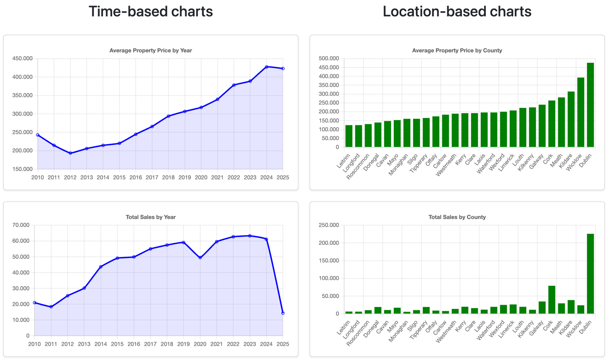
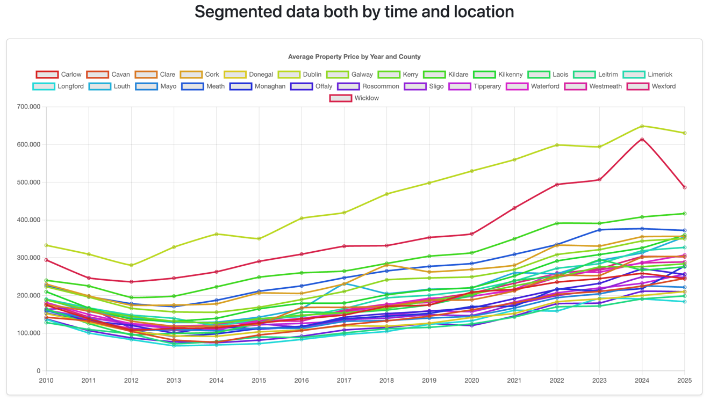
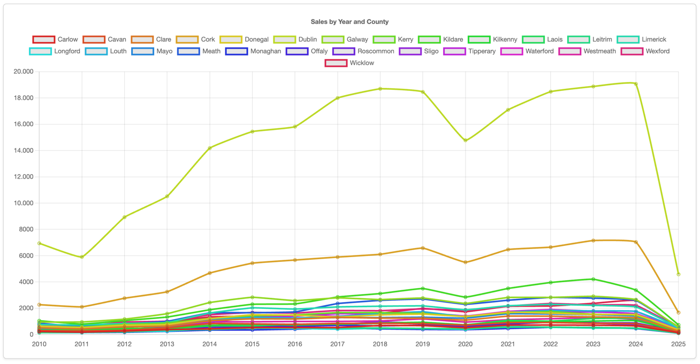
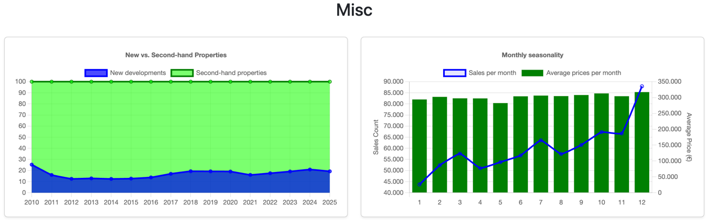
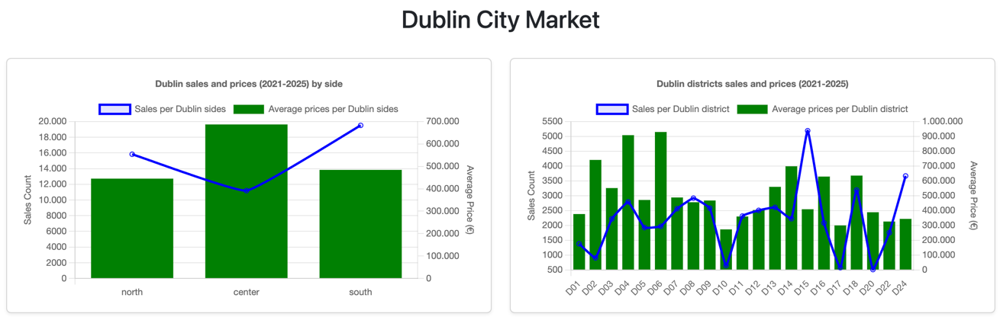

# 🇮🇪 Irish Property Market Visualizer

This project loads historical data from the **Irish Property Price Register (PPR)**, stores it in a **SQLite database**, and visualizes trends using **Chart.js** in an interactive browser dashboard. The charts provide a visual overview of how residential property prices and transaction volumes have evolved across Ireland over time.

---

## Data Source: Irish Property Price Register

The original data is published by the **Property Services Regulatory Authority (PSRA)** at: https://www.propertypriceregister.ie

You can download the most up-to-date CSV directly on the website, or alternatively, use the file provided in the project under `data/PPR-ALL.csv`, which contains all the information up to the end of April 2025.

---

## How to Set It Up

1. **Clone the project**
    ```bash
    git clone https://github.com/venturarome/rppr-ie.git
    cd rppr-ie
    ```

2. Optionally, download the updated CSV:
    * Go to https://www.propertypriceregister.ie
	* Download the CSV (all years or selected years)
	* Save it as `data/PPR-ALL.csv`.

3. Run the import script:
    ```bash
    php scripts/import.php
    ```
    This will create a SQLite database file under `data/rppr-ie-db.sqlite` and import all property records.

4. Start a local server
   ```bash
   php -S localhost:8000
   ```

5. Finally, open `http://localhost:8000/scripts/charts.php`

---
### Dependencies
* PHP 8.0+
* SQLite3 extension enabled
* Chart.js via CDN

---

### License

This project is for educational and analytical purposes. The property data belongs to the Property Services Regulatory Authority (PSRA) and is freely available on their website.

---

---

## Data Analysis Results
The most significant charts are shown below:





Based on those visualizations, we can extract:
* **Steady Price Growth**: Average property prices have shown a consistent upward trend year-over-year since 2013, especially in urban counties like Dublin and Cork.
* **Sales Volume Recovery**: After a dip in sales volume around 2020 (likely due to COVID-19), transaction counts rebounded strongly in 2021 and 2022.
* **County Disparities**:
  * Dublin maintains the highest average prices, often exceeding €400,000 in recent years. Along with Cork, they represent almost half of the sales on Ireland. 
  * Counties like Leitrim and Longford have among the lowest average prices but show sharper relative increases over time.
  * Wicklow shows higher prices than most of the counties, but with a similar market size.
* **New vs Second-Hand Properties**:
  * Second-hand properties make up the majority of transactions each year.
  * New builds account for a smaller but growing share in certain counties with active development zones.
* **Seasonality**: Most of the sales occur on the second half of the year, with a specially notable peak on December.
* **Dublin City Market**: given that Dublin county hosts the biggest numbers, and that Dublin City is the capital, a special mention to its local market was needed. The eircode system was introduced in 2015, but it was not until 2021 that it became more widely used in the PPR database, so only properties sold from 2021 were considered. It is clear the price difference between the center and the north/south sides, as well as the market size (center being more expensive and having less transactions).
These results help highlight long-term market trends and regional dynamics in Irish real estate.

---


